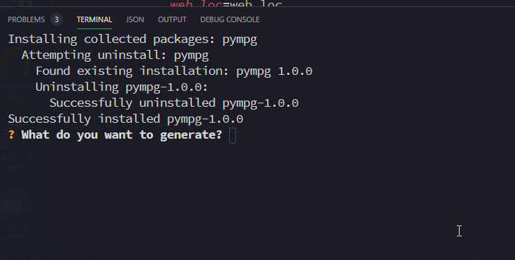

# pympg
<!-- ALL-CONTRIBUTORS-BADGE:START - Do not remove or modify this section -->

<!-- ALL-CONTRIBUTORS-BADGE:END -->

Command-line multipurpose config generator.

## Example

## Prerequisites

-   Latest version of Python 3
-   For apache2 config generation, obviously apache2.

## Installation

-   Run `pip3 install pympg` to install this package.
-   Run `sudo pympg` to open the generation prompt.

## Development Build Instructions

### Prerequisites

-   Python 3
-   Python poetry

### Building

-   `git clone https://github.com/throw-out-error/pympg.git`
-   CD into the folder
-   Run `./build.sh` to build the package and install it.
-   Run `sudo pympg` to run pympg

## Contributors ✨

Thanks goes to these wonderful people ([emoji key](https://allcontributors.org/docs/en/emoji-key)):

<!-- ALL-CONTRIBUTORS-LIST:START - Do not remove or modify this section -->
<!-- prettier-ignore-start -->
<!-- markdownlint-disable -->
<table>
  <tr>
    <td align="center"><a href="https://onyxcode.net"> <b>Dan</b></a> <a href="https://github.com/throw-out-error/pympg/commits?author=onyxcode" title="Code">💻</a></td>
    <td align="center"><a href="https://theoparis.com/about"> <b>Theo Paris</b></a> <a href="https://github.com/throw-out-error/pympg/commits?author=creepinson" title="Documentation">📖</a> <a href="https://github.com/throw-out-error/pympg/commits?author=creepinson" title="Code">💻</a></td>
  </tr>
</table>

<!-- markdownlint-enable -->
<!-- prettier-ignore-end -->
<!-- ALL-CONTRIBUTORS-LIST:END -->

This project follows the [all-contributors](https://github.com/all-contributors/all-contributors) specification. Contributions of any kind welcome!